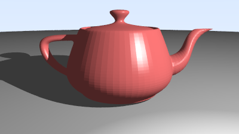
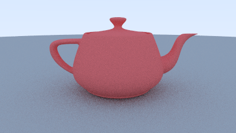
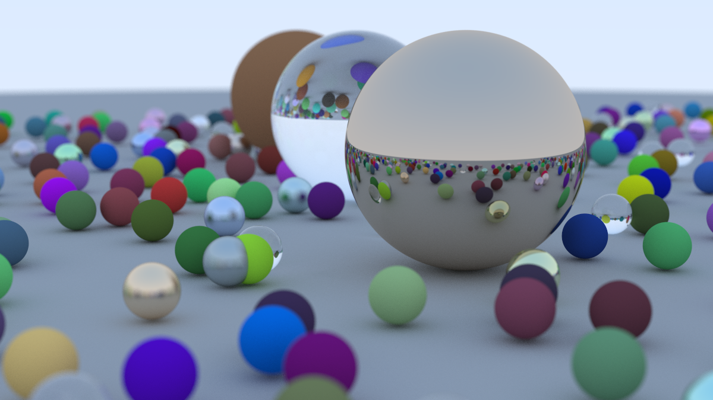

# Raytracer

A CPU raytracer written from scratch in C++, built incrementally following *Ray Tracing in One Weekend* and extended with triangle meshes, OBJ loading, and Phong shading with shadows.

## Features

- **Primitives** - spheres and triangles
- **Materials** - Lambertian (diffuse), metal (reflective with fuzz), dielectric (glass with Schlick reflectance), Phong (ambient + diffuse + specular)
- **Camera** - configurable FOV, look-from/look-at, depth-of-field via defocus disk
- **Lighting** - point light with shadow rays
- **Mesh loading** - OBJ files (fan-triangulated polygons, `v`/`f` directives; normals and UVs ignored in favour of geometric normals)
- **Anti-aliasing** - multi-sample per pixel
- **Output** - PPM written to stdout, pipe to any image viewer

## Gallery


| Scene | Image |
|---|---|
| Utah Teapot - Phong shading with shadows |  |
| Utah Teapot  unshaded |  |
| Three spheres |  |

## Build & Run

```bash
g++ -std=c++17 -O2 -o main main.cpp
./main > image.ppm
```

Convert to PNG (requires ImageMagick):

```bash
convert image.ppm image.png
```

## Usage

Edit `main.cpp` to configure the scene, then recompile.

**Camera settings:**

```cpp
cam.aspect_ratio      = 16.0 / 9.0;
cam.image_width       = 800;
cam.samples_per_pixel = 100;  
cam.max_depth         = 50;   

cam.vfov     = 40;
cam.lookfrom = point3(0, 2, 5);
cam.lookat   = point3(0, 1, 0);

cam.light_pos   = point3(5, 5, 5);
cam.light_color = color(1, 1, 1);
```

**Loading an OBJ mesh:**

```cpp
#include "mesh.h"

auto mat = make_shared<phong>(color(0.8, 0.5, 0.2), 64.0);
load_obj("utah_teapot.obj", world, mat);
```

## File Overview

| File | Purpose |
|---|---|
| `main.cpp` | Scene definition and entry point |
| `camera.h` | Ray generation, Phong/scatter shading, PPM output |
| `material.h` | Lambertian, metal, dielectric, Phong materials |
| `sphere.h` | Sphere primitive |
| `triangle.h` | Triangle primitive (Möller–Trumbore intersection) |
| `mesh.h` | OBJ loader — parses `v`/`f`, fan-triangulates polygons |
| `hittable.h` / `hittable_list.h` | Hit record and scene container |
| `ray.h` / `vec3.h` | Math primitives |
| `rtweekend.h` | Constants, utilities |
| `interval.h` | Ray t-interval helpers |

## Rendering Notes

- **Phong materials** go through the direct-lighting path (shadow ray + Phong terms); all other materials use the recursive path-tracing path.
- OBJ files are expected to be in the working directory. Negative indices and relative-path texture references are not supported.
- Render time scales with `image_width × samples_per_pixel × max_depth` and scene triangle count. The teapot (~6 k triangles) at 800 px / 100 spp takes a few minutes single-threaded.
